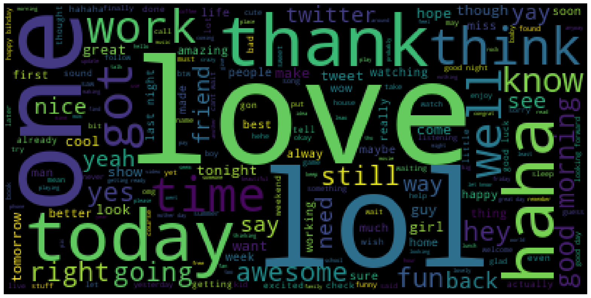
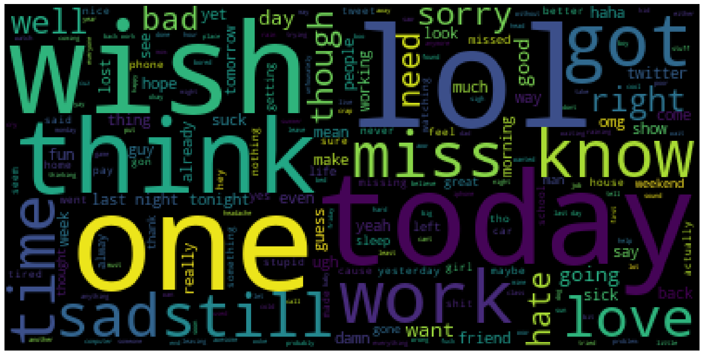
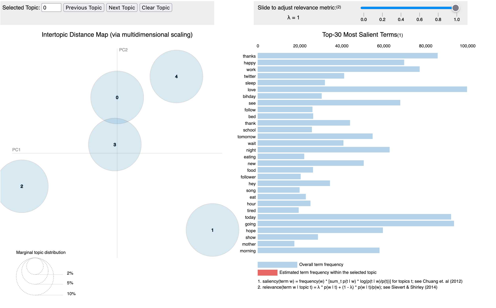

# Abstract
Twitter is a popular social media platform that has become an important source of data for sentiment analysis. 
In this paper, we investigate the use of machine learning approaches for analyzing the sentiment of tweets. 
We compare the performance of several popular machine learning algorithms on a dataset of Twitter data, and evaluate their ability to accurately predict the sentiment of tweets. 
Our results show that support vector machines and random forests perform well on this task, achieving an accuracy of over 80%. We also discuss the challenges of sentiment analysis on Twitter data, and highlight the importance of data cleaning and preprocessing for improving the performance of machine learning algorithms.

# Introduction

Twitter is a popular social media platform that allows users to post short messages, known as tweets, which can be up to 280 characters in length. Twitter has become an important source of data for sentiment analysis, as it provides a large amount of real-time information about people's opinions and emotions on a wide range of topics.

Sentiment analysis, also known as opinion mining, is the process of automatically identifying and extracting subjective information from text data. Sentiment analysis can be useful for various applications, such as market research, customer feedback analysis, and political analysis. In the context of Twitter data, sentiment analysis can help identify trends and patterns in people's opinions and emotions, and provide insights into how people feel about various topics.

Machine learning is a powerful tool for performing sentiment analysis on Twitter data. Machine learning algorithms can learn from examples and make predictions based on patterns in the data. In this paper, we investigate the use of machine learning approaches for sentiment analysis on Twitter data. We compare the performance of several popular machine learning algorithms, and evaluate their ability to accurately predict the sentiment of tweets.

The Sentiment140 dataset is collected using Twitter Search API for one such study, and the tweets are labeled on the assumption that positive emoticons such as :) denote positive emotion and negative emoticons such as :( denote a negative emotion.
[TODO: Add more details about the dataset]

# Data Preprocessing

Performing data cleaning on text data can help improve the accuracy of the analysis by removing irrelevant or noisy data, and it can also make the data more manageable by reducing the dimensionality and making it easier to work with. Additionally, cleaning the data can help ensure that the results of the analysis are consistent and reproducible, which is important for generating reliable insights from the data.

Performed the following steps to clean the data:
1. Remove URLs and other irrelevant information from the tweets. This can be done using regular expressions or string manipulation techniques.
2. Remove hashtags and other irrelevant symbols from the tweets. This can also be done using regular expressions or string manipulation techniques. 
3. Remove stop words from the tweets. Stop words are common words such as "the" and "and" that do not provide any useful information for sentiment analysis.
4. Remove any remaining noisy or irrelevant data from the tweets. This can include words or phrases that do not provide any useful information for sentiment analysis, such as numbers or non-English words. 
5. Tokenize the tweets. This involves splitting the tweets into individual words or phrases, which can then be used for further analysis.
6. Perform lemmatization on the tokens. Lemmatization are techniques that reduce words to their base form, which can help reduce the dimensionality of the data and make it easier to analyze. 
 

```python
import re
from nltk.corpus import stopwords
from nltk.stem import WordNetLemmatizer
from nltk.tokenize import word_tokenize

stop_words = set(stopwords.words('english'))
stop_words.add('quot')
stop_words.add('amp')
lemma = WordNetLemmatizer()

def preprocess(text):
  text = str(text).lower().strip()
  text = re.sub(r'http\S+|www.\S+', '', text)
  text = re.sub(r'@\S+', '', text)
  text = re.sub(r'#\S+', '', text)
  text = re.sub(r'RT', '', text)
  text = re.sub(r'(.)\1\1+', r'\1\1', text)
  text = re.sub("[^a-zA-Z0-9]", " ", text)
  text = word_tokenize(text)
  text = [item for item in text if item not in stop_words]
  text = [lemma.lemmatize(w) for w in text]
  text = [i for i in text if len(i) > 1]
  text = ' '.join(text)
  return text
```

## Train & Test Data Labels

The training dataset consists of equal number of positive and negative tweets. Whereas, the test dataset consists of negative, neutral and positive tweets.
 
We had three different approaches to this problem:
1. Approach which involved removing all the neutral labels from the test 
2. An approach which involves classifying all the neutral(‘2’) labels as positive(‘4’)
3. A classic approach where we used a part of train data, set aside to be our test data.
 
We tried to mix and match all these approaches in our various methods while testing different models. 
Since our data is labeled, we can do the classification, which is the main goal of this research, using a variety of linear algorithms.
`Logistic Regression`, `Decision Tree Classifier`, `Naive Bayes Classifier`, `LinearSVC`, `SVD`, `XGBoost Classifier`, and `Random Forest Classifier` were the techniques we considered for analyzing the tweet. All these methods use different approaches to learn from the data and each approach yields different results.

## Data Visualization
We plotted word clouds for all the positive and negative labels, to visualize the most frequent words after removing the stopwords.

### Word cloud for the entire dataset
\
*Fig. Word cloud*

### Word cloud for positive tweets
\
*Fig. Positive Word cloud*

### Word cloud for negative tweets
\
*Fig. Negative Word cloud*

[TODO - Vinit - Top 10 Words]

#### Observations
Learning from the data:
There’s clearly a pattern between the words which we generally define as either good or bad. 
Words such as ‘work’, ‘today’, ‘hate’ etc., usually refers to a negative emotion, while words such as ‘good’, ‘thank’, ‘like’ are referred to as something positive. 
We have also plotted a barchart to determine the top-10 most used words in the dataset. 
This can be considered as one of our evaluation metrics as we can visually infer from the data and know that the model learnt something. 
However, it is not very accurate.

# Discussion

Sentiment analysis on Twitter data can be challenging due to the noisy and unstructured nature of the data. Twitter users often use slang, abbreviations, and emoticons, which can make it difficult for algorithms to accurately identify the sentiment of tweets. In addition, the use of sarcasm and irony is common on Twitter, which can lead to misclassification of the sentiment of tweets.

Preprocessing the data can help improve the performance of machine learning algorithms for sentiment analysis on Twitter data. By removing irrelevant and noisy information from the tweets, and reducing the dimensionality of the data, the algorithms can more easily learn the patterns in the data and make more accurate predictions.


# Methods
Our data deals with text and its keywords. Since the machine doesn't actually know what those keywords actually are, it needs to learn from that data to know which words determine which sentiment.
We used the Tf-Idf vectorizer by SciKit Learn for doing that. It adds weights to a word based on the total number of times the word has appeared in the dataset. 
The function can also retrieve the number of features we require based on our input.

[TODO - Everyone - Add more details about the methods]
## Topic Modeling

### Pachinko Allocation
The Directed Acyclic Graph method is used to capture random, hierarchical, and even sparse correlation between subjects.
The dirichlet distribution is represented by the list of all words that were extracted from the corpus after the stopwords were removed and text processing was completed.
Through a Directed Acyclic Graph, each topic created by a PAM is connected to the Dirichlet distribution (DAG).

\
*Fig. PAM*

# Comparisons
---------------------------------------
| Model                    | Accuracy | 
|--------------------------|----------|
| Logistic Regression      | 0.73     | 
| Decision Tree Classifier | 0.64     |  
| Naive Bayes Classifier   | 0.72     | 
| LinearSVC                | 0.80     |
| XGBoost Classifier       | 0.68     | 
| Random Forest Classifier | 0.61     | 
| LSTM                     | 0.78     |
---------------------------------------


# Example Analysis
[TODO - Vinit]
  

# Conclusions
[TODO - Sathvick & Prabhath]


# References
1. https://github.com/flairNLP/flair
2. https://bab2min.github.io/tomotopy/v0.12.3/en/
3. https://iq.opengenus.org/pachinko-allocation-model/
