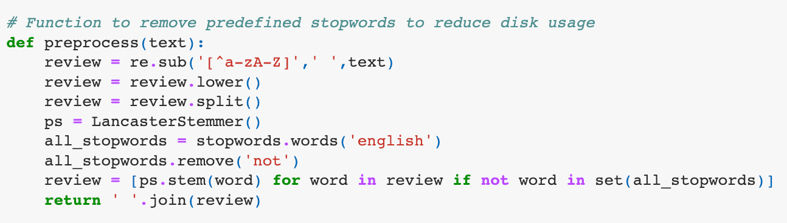

# Abstract

# Introduction

The exponential growth of people using the internet has allowed them to share their views, opinions and stories on various web platforms such as Facebook,Twitter or Blogger.
With such vast amounts of data, it is difficult to know the emotion of the data. 
Opinion mining is a critical field to analyze this largely unstructured information to know the current trends or predict the future trends.
The objective of our project is to perform sentiment analysis on the Twitter dataset to know the underlying intent or tone of the tweets made.
The Sentiment140 dataset is collected using Twitter Search API for one such study, and the tweets are labeled on the assumption that positive emoticons such as :) denote positive emotion and negative emoticons such as :( denote a negative emotion. 
We are using various machine learning algorithms for performing the classification and as an evaluation metric.

# Methodology

## Data Preprocessing
We performed various data cleaning techniques before performing classification. 
Firstly, we checked for missing values in the dataset, and luckily the dataset was compiled properly, so they were labeled properly and had no missing values.
Since the data is collected from the web it is not very clean and has many stopwords in it.
Strings such as ‘http’, ‘@..’, ‘#...’, adds no significant meaning to the model, and unnecessarily takes up disk storage and increases the time complexity of the model. 

\
*Fig. Data cleaning*

The total mentions of those characters and tags in the dataset makeup to more than 800k, and so we removed them to improve the model performance. 
There are many more stopwords that are pre-trained in the natural language toolkit(NLTK) library, that take up to about 15% of the total storage taken up by the dataset.
We defined a function to remove all those stop words defined in the library, and called it on the train set.

## Train & Test Data 

The data in the train set is labeled as either 0 or 4. ‘0’ meaning negative sentiment and ‘4’ meaning positive sentiment. But in the test data, there is an additional label ‘2’ which says that the tweet is neutral. This is a serious problem as the model trains on only two sets of labels and while testing all the data with a different label is immediately considered wrong. 
 
We had three different approaches to this problem:
1. Approach which involved removing all the neutral labels from the test 
2. An approach which involves classifying all the neutral(‘2’) labels as positive(‘4’)
3. A classic approach where we used a part of train data, set aside to be our test data.
 
We tried to mix and match all these approaches in our various methods while testing different models. 
Our data is labeled, so many linear approaches can be used to perform the classification, which is our objective of doing this project.
The methods we considered to analyze the sentiment were Logistic Regression, Decision Tree Classifier, Naive Bayes classifier, LinearSVC, SVD, XGBoost Classifier and Random Forest Classifier.
All these methods use different approaches to learn from the data and each approach yields different results.

## Data Visualization
We plotted word clouds for all the positive and negative labels, to visualize the most frequent words after removing the stopwords.

### Word cloud for the entire dataset
\
*Fig. Word cloud*

### Top-10 Words for the entire dataset

*Fig. Top-10 Words*

### Observations
Learning from the data:
There’s clearly a pattern between the words which we generally define as either good or bad. 
Words such as ‘work’, ‘today’, ‘hate’ etc., usually refers to a negative emotion, while words such as ‘good’, ‘thank’, ‘like’ are referred to as something positive. 
We have also plotted a barchart to determine the top-10 most used words in the dataset. 
This can be considered as one of our evaluation metrics as we can visually infer from the data and know that the model learnt something. 
However, it is not very accurate.

## Tf-Idf Vectorizer 
Our data deals with text and its keywords. Since the machine doesn't actually know what those keywords actually are, it needs to learn from that data to know which words determine which sentiment.
We used the Tf-Idf vectorizer by SciKit Learn for doing that. It adds weights to a word based on the total number of times the word has appeared in the dataset. 
The function can also retrieve the number of features we require based on our input.

## XGBoost Classifier
It is a gradient boosting package that implements a gradient boosting framework. The algorithm is scalable for parallel computing and is considered as the algorithm of choice for classification and regression. The XGBoost library implements the gradient boosting decision tree algorithm.Effective with large data sets. It stands out as the leading machine learning library for regression, classification, and ranking problems. The two primary reasons to use XGBoost are its execution speed and model performance making it a popular supervised-learning algorithm used for regression and classification on large datasets. Since the gradient of the data is considered for each tree, the calculation is faster and the precision is accurate than Random Forest.

## Random Forest Classifier
Random forest is a commonly-used machine learning algorithm, which combines the output of multiple decision trees to reach a single result. Random forest is a Supervised Machine Learning Algorithm that is used widely in Classification and Regression problems.  It builds decision trees on different samples and takes their majority vote for classification and average in case of regression.Before understanding the working of the random forest algorithm in machine learning, we must look into the ensemble technique. Ensemble simply means combining multiple models. Thus a collection of models is used to make predictions rather than an individual model. Random forests are created from subsets of data and the final output is based on average or majority ranking and hence the problem of overfitting is taken care of. 

Random forest randomly selects observations, builds a decision tree and the average result is taken. It doesn’t use any set of formulas.Random forest builds multiple decision trees and merges them together to get a more accurate and stable prediction. The “forest” it builds is an ensemble of decision trees, usually trained with the “bagging” method. The general idea of the bagging method is that a combination of learning models increases the overall result.Random forest adds additional randomness to the model while growing the trees. Instead of searching for the most important feature while splitting a node, it searches for the best feature among a random subset of features. This results in a wide diversity that generally results in a better model.

## Tree algorithms such as XGBoost and Random Forest do not need normalized features and work well if the data is nonlinear, non-monotonic, or with segregated clusters.

## Logistic Regression
It is a type of statistical model that is often used for classification and predictive analytics. Logistic regression estimates the probability of an event occurring, based on a given dataset of independent variables. logistic regression is also used to estimate the relationship between a dependent variable and one or more independent variables, but it is used to make a prediction about a categorical variable versus a continuous one. It is also considered a discriminative model, which means that it attempts to distinguish between classes (or categories). Logistic Regression is used when the dependent variable(target) is categorical. Logistic regression helps organizations gain actionable insights from their business data. Less complex than other ML methods and also can process large volumes of data at high speed because they require less computational capacity,
 
The logistic regression model which is used in our project gives the accuracy of the model in predicting the sentiments correctly, a confusion matrix to evaluate the model performance and classification report with evaluation metrics like accuracy, precision, recall, f1-score, support, macro average and weighted average. As a part of building sentiment classifiers using logistic regression, we train the model on twitter sample dataset. It is called supervised because the model predictions are iteratively evaluated and corrected against the output values, until an acceptable performance is achieved. 

## Naive Bayes
Naive Bayes is the simplest and fastest classification algorithm for a large chunk of data.It uses the Bayes probability theorem for unknown class prediction. The use of Bayes’ theorem with a strong independence assumption between the features is the basis for naive Bayes classification. All of the features in the Naive Bayes Classifier are assumed to be unrelated. Naive Bayes classifier is a general term which refers to conditional independence of each of the features in the model, while Multinomial Naive Bayes classifier is a specific instance of a Naive Bayes classifier which uses a multinomial distribution for each of the features. The multinomial Naive Bayes classifier is suitable for classification with discrete features. Multinomial Naïve Bayes consider a feature vector where a given term represents the number of times it appears or very often i.e. frequency.

## Linear Support Vector Classification

Linear Support Vector Classification is similar to SVC with parameter kernel=’linear’, but implemented in terms of liblinear rather than libsvm, so it has more flexibility in the choice of penalties and loss functions and should scale better to large numbers of samples.This supports both dense and sparse input and the multiclass support is handled according to a one-vs-the-rest scheme. 
https://scikit-learn.org/stable/modules/generated/sklearn.svm.LinearSVC.html

This is the linear model which we have used in our project. We initially trained a Linear Support Vectoer Classification on the training data and tested it on test dataset available in the dataset. The accuracy was less when we used the entire test dataset as test dataset contained tweets belonging to neutral class which werent available in the training dataset. This was the reason behind the less accuracy when we tested the model on test dataseet after removing all the neutral tweets we got better accuracy.

## Topic Modeling

### Latent Dirchilet ALlocation

Topic modeling helps in finding the abstract topics present in the text. Latent Dirichlet Allocation (LDA) builds a topic per document model and words per topic model, modeled as Dirichlet distributions. We are going to apply LDA to a set of documents and split them into topics.
https://towardsdatascience.com/topic-modeling-and-latent-dirichlet-allocation-in-python-9bf156893c24

We have performed topic modeling using LDA on the entire dataset and generated 10 topics. We tried generating more topics but we felt that with LDA we got meaningful topics when we limited the number of topics to 10.

*Fig. Topic Modeling using LDA*

### Pachinko Allocation

The Directed Acyclic Graph method is used to capture random, hierarchical, and even sparse correlation between subjects.
The dirichlet distribution is represented by the list of all words that were extracted from the corpus after the stopwords were removed and text processing was completed.
Through a Directed Acyclic Graph, each topic created by a PAM is connected to the Dirichlet distribution (DAG).

\
*Fig. PAM*

## Comparisons

## Example Analysis
  

## Conclusions

### 1. Do you have enough data to learn?

We used  sentiment140 dataset to learn about the sentiment associated with text. We used a training dataset to train the model and later tested using with testing dataset which was available in the dataset. I think the model had enough data to learn as the predictions had good accuracy.

### 2. Are you implementing Two step learning process?

In our project, we had models which implemented Two step learning process. 
We can observe that Ein -> 0 as our training accuracy is 78%.The test accuracy is 80% which is close to our training accuracy.This means that our Eout -> Ein. Overall, we can tell that we implemented a two-step learning process and this learning helped in getting better test results.

*Fig. Accuracy on train & test*

# References
1. https://github.com/flairNLP/flair
2. https://bab2min.github.io/tomotopy/v0.12.3/en/
3. https://iq.opengenus.org/pachinko-allocation-model/
