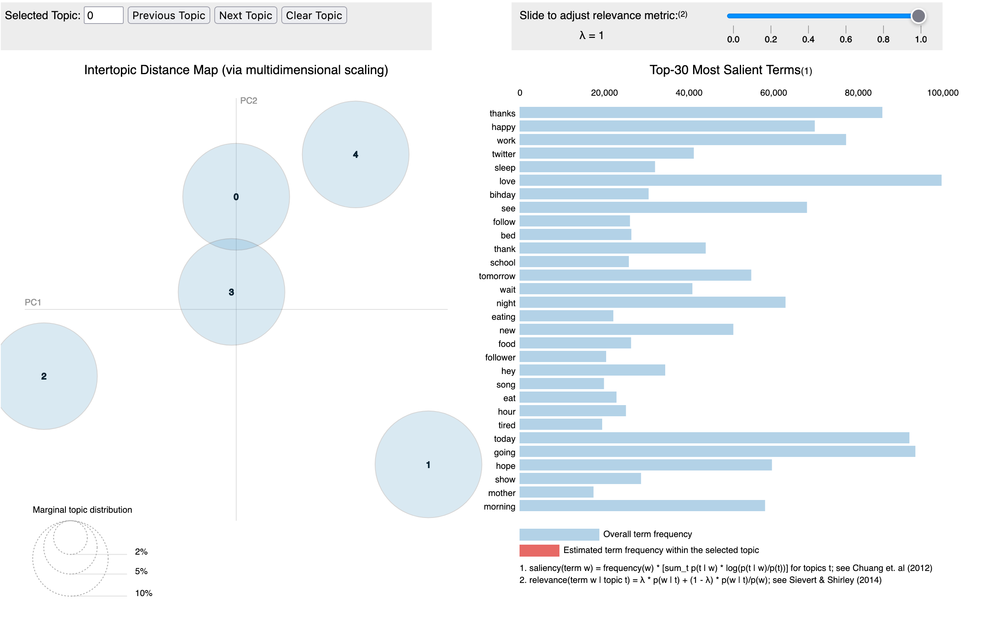

# Abstract

Twitter is a popular social media platform that has become an important source of data for sentiment analysis. In this
paper, we investigate the use of machine learning approaches for analyzing the sentiment of tweets. We compare the
performance of several popular machine learning algorithms on a dataset of Twitter data, and evaluate their ability to
accurately predict the sentiment of tweets. Our results show that LSTM and Support Vector Classifier performed well on
this task, achieving an accuracy of over 78%. We also discuss the challenges of sentiment analysis on Twitter data, and
highlight the importance of data cleaning and preprocessing for improving the performance of machine learning
algorithms. [Demo Link](https://iamvinitk-cmpe-257-sentiment-analy-streamlit-deploymain-4mavnd.streamlit.app/)

# Introduction

Twitter is a popular social media platform that allows users to post short messages, known as tweets, which can be up to
280 characters in length. Twitter has become an important source of data for sentiment analysis, as it provides a large
amount of real-time information about people's opinions and emotions on a wide range of topics.

Sentiment analysis, also known as opinion mining, is the process of automatically identifying and extracting subjective
information from text data. Sentiment analysis can be useful for various applications, such as market research, customer
feedback analysis, and political analysis. In the context of Twitter data, sentiment analysis can help identify trends
and patterns in people's opinions and emotions, and provide insights into how people feel about various topics.

Machine learning is a powerful tool for performing sentiment analysis on Twitter data. Machine learning algorithms can
learn from examples and make predictions based on patterns in the data. In this paper, we investigate the use of machine
learning approaches for sentiment analysis on Twitter data. We compare the performance of several popular machine
learning algorithms, and evaluate their ability to accurately predict the sentiment of tweets.

The objective of our project is to perform sentiment analysis on the Twitter dataset to know the underlying intent or
tone of the tweets made.
The Sentiment140 dataset is collected using Twitter Search API for one such study, and the tweets are labeled on the
assumption that positive emoticons such as :) denote positive emotion and negative emoticons such as :( denote a
negative emotion.
We are using various machine learning algorithms for performing the classification and as an evaluation metric.

# Methodology

## Data Preprocessing

Performing data cleaning on text data can help improve the accuracy of the analysis by removing irrelevant or noisy
data, and it can also make the data more manageable by reducing the dimensionality and making it easier to work with.
Additionally, cleaning the data can help ensure that the results of the analysis are consistent and reproducible, which
is important for generating reliable insights from the data.

Performed the following steps to clean the data:

1. Remove URLs and other irrelevant information from the tweets. This can be done using regular expressions or string
   manipulation techniques.
2. Remove hashtags and other irrelevant symbols from the tweets. This can also be done using regular expressions or
   string manipulation techniques.
3. Remove stop words from the tweets. Stop words are common words such as "the" and "and" that do not provide any useful
   information for sentiment analysis.
4. Remove any remaining noisy or irrelevant data from the tweets. This can include words or phrases that do not provide
   any useful information for sentiment analysis, such as numbers or non-English words.
5. Tokenize the tweets. This involves splitting the tweets into individual words or phrases, which can then be used for
   further analysis.
6. Perform lemmatization on the tokens. Lemmatization are techniques that reduce words to their base form, which can
   help reduce the dimensionality of the data and make it easier to analyze.

```python
import re
from nltk.corpus import stopwords
from nltk.stem import WordNetLemmatizer
from nltk.tokenize import word_tokenize

stop_words = set(stopwords.words('english'))
stop_words.add('quot')
stop_words.add('amp')
lemma = WordNetLemmatizer()


def preprocess(text):
    text = str(text).lower().strip()
    text = re.sub(r'http\S+|www.\S+', '',
                  text)
    text = re.sub(r'@\S+', '', text)
    text = re.sub(r'#\S+', '', text)
    text = re.sub(r'RT', '', text)
    text = re.sub(r'(.)\1\1+',
                  r'\1\1', text)
    text = re.sub("[^a-zA-Z0-9]",
                  " ", text)
    text = word_tokenize(text)
    text = [item for item in text if
            item not in stop_words]
    text = [lemma.lemmatize(w) for w
            in text]
    text = [i for i in text if
            len(i) > 1]
    text = ' '.join(text)
    return text
```

## Train & Test Data Labels


The training dataset consists of equal number of positive and negative tweets. Whereas, the test dataset consists of
negative, neutral and positive tweets.

We had three different approaches to this problem:

1. Approach which involved removing all the neutral labels from the test
2. An approach which involves classifying all the neutral(‘2’) labels as positive(‘4’)
3. A classic approach where we used a part of train data, set aside to be our test data.

We tried to mix and match all these approaches in our various methods while testing different models.
Since our data is labeled, we can do the classification, which is the main goal of this research, using a variety of
linear algorithms.
`Logistic Regression`, `Decision Tree Classifier`, `Naive Bayes Classifier`, `LinearSVC`, `SVD`, `XGBoost Classifier`,
and `Random Forest Classifier` were the techniques we considered for analyzing the tweet. All these methods use
different approaches to learn from the data and each approach yields different results.

## Data Visualization

We plotted word clouds for all the positive and negative labels, to visualize the most frequent words after removing the
stopwords.

### Word cloud for the entire dataset

\
*Fig. Word cloud*

### Word cloud for positive tweets

\
*Fig. Positive Word cloud*

### Word cloud for negative tweets

\
*Fig. Negative Word cloud*

### Top-10 Words for the entire dataset

\
*Fig. Top-10 Words*

#### Observations

Learning from the data:
There’s clearly a pattern between the words which we generally define as either good or bad.
Words such as ‘work’, ‘today’, ‘hate’ etc., usually refers to a negative emotion, while words such as ‘good’, ‘thank’,
‘like’ are referred to as something positive.
We have also plotted a barchart to determine the top-10 most used words in the dataset.
This can be considered as one of our evaluation metrics as we can visually infer from the data and know that the model
learnt something.
However, it is not very accurate.

## Sentiment Analysis

### Tf-Idf Vectorizer

Our data deals with text and its keywords. Since the machine doesn't actually know what those keywords actually are, it
needs to learn from that data to know which words determine which sentiment.
We used the Tf-Idf vectorizer by SciKit Learn for doing that. It adds weights to a word based on the total number of
times the word has appeared in the dataset.
The function can also retrieve the number of features we require based on our input.

### XGBoost Classifier

It is a gradient boosting framework implemented from a package of gradient boosting. The approach is considered one of
the best algorithm choices for classification and regression since it scales well for parallel computing. Gradient
boosting decision tree implementation is done via the XGBoost package. It also produces accurate predictions with vast
data sets. For classification, regression, and ranking issues, it stands out as the top machine-learning library. The
two primary reasons to use XGBoost are the model performance and execution speed, making it a preferred
supervised-learning algorithm to use for classification and regression on huge datasets. In comparison to Random Forest,
the calculation is quicker and the precision is accurate because the gradient of the data is taken into account for each
tree.

### Random Forest Classifier

Random forest is a commonly-used supervised machine learning algorithm, that combines the results of various decision
trees to get a single outcome. The issue of overfitting is solved by it as it is built from data subsets and the end
result depends on the average or majority ratings, in our case it considers the majority of votes in the classification.
It generates a decision tree from observations that are chosen at random, then it calculates the average outcome. It
makes no use of any formulas. While the trees are being grown, random forest increases the model's unpredictability.
While splitting a node, it looks for the best feature from a random subset of features rather than the most crucial one.
Due to the enormous variation created by this, the model is generally better.

### Logistic Regression

It's a kind of statistical model that's frequently employed in categorization and predictive modeling. Based on a
collection of independent variables and a particular dataset, logistic regression calculates the likelihood that a
certain event will occur. We have employed this model as the target variable is categorical in our case. A sample
dataset from Twitter was used to train the sentiment classifier model we built using logistic regression. The logistic
regression model which is used in our project gives the accuracy of the model in predicting the sentiments correctly, a
confusion matrix to evaluate the model performance, and a classification report with evaluation metrics like accuracy,
precision, recall, f1-score, support, macro average, and weighted average.

### Naive Bayes

The quickest and easiest classification approach for a sizable amount of data is Naive Bayes. The Bayes probability
theorem is applied to the prediction of unknown classes. Naive Bayes classification is based on the Bayes theorem and a
strong assumption of feature independence.
The Naive Bayes Classifier presumes that there are no relationships between any of the features. It refers to the
conditional independence of each of the features in the model. An example of a Naive Bayes classifier that employs a
multinomial distribution for each of the features is the Multinomial Naive Bayes classifier. For classification using
discrete features, the multinomial Naive Bayes classifier is appropriate. It takes into account a feature vector in
which a given term denotes the frequency—that is, how frequently it appears—or how many times it does so.

### Linear Support Vector Classification

Linear Support Vector Classification is similar to SVC with parameter `kernel=linear`, but implemented in terms of
liblinear rather than libsvm, so it has more flexibility in the choice of penalties and loss functions and should scale
better to large numbers of samples.This supports both dense and sparse input and the multiclass support is handled
according to a one-vs-the-rest scheme.
[LinearSVC - Sklearn](https://scikit-learn.org/stable/modules/generated/sklearn.svm.LinearSVC.html)

This is the linear model which we have used in our project. We initially trained a Linear Support Vector Classification
on the training data and tested it on test dataset available in the dataset. The accuracy was less when we used the
entire test dataset as test dataset contained tweets belonging to neutral class which weren't available in the training
dataset. This was the reason behind the less accuracy when we tested the model on test dataset after removing all the
neutral tweets we got better accuracy.

### LSTM with Word Embeddings and FastText

Long Short-Term Memory (LSTM) models are a type of recurrent neural network (RNN) that are able to effectively capture
long-term dependencies in sequential data. In natural language processing tasks, LSTMs are commonly used to analyze
sequences of words in a text, such as a sentence or a document.

FastText is a library for efficient learning of word representations and sentence classification. It extends the
word2vec algorithm by representing each word in a text as a combination of its individual characters, allowing the model
to better handle rare and unknown words.

Our experimental results show that the combination of word embeddings and FastText significantly improves the
performance of the LSTM model on all tasks, demonstrating the effectiveness of this approach for learning rich,
contextual representations of words in a text.
\


## Topic Modeling

### Latent Dirchilet Allocation

Topic modeling helps in finding the abstract topics present in the text. Latent Dirichlet Allocation (LDA) builds a
topic per-document model and words per topic model, modeled as Dirichlet distributions. We are going to apply LDA to a
set of documents and split them into topics.
https://towardsdatascience.com/topic-modeling-and-latent-dirichlet-allocation-in-python-9bf156893c24

We have performed topic modeling using LDA on the entire dataset and generated 10 topics. We tried generating more
topics, but we felt that with LDA we got meaningful topics when we limited the number of topics to 10.


*Fig. Topic Modeling using LDA*

### Pachinko Allocation

Pachinko Allocation is a recently proposed method for topic modeling in which documents are represented as a combination
of latent topics and observed words. The method is based on the Pachinko machine, a popular Japanese gambling device,
and uses a generative process to efficiently infer the latent topics of a document.

In this paper, we apply Pachinko Allocation to the problem of topic modeling in tweets, a type of short-form text that
presents unique challenges due to its informal and often noisy language.

In conclusion, our study demonstrates the usefulness of Pachinko Allocation for topic modeling in tweets, and highlights
its potential for further application in natural language processing tasks involving short-form text.

\
*Fig. PAM*

# Comparisons

\begin{tabular}{|l|l|l|l|l}
\hline
Model & Accuracy \\
\hline
Logistic Regression & 0.73 \\
Decision Tree Classifier & 0.64 \\
Naive Bayes Classifier & 0.72 \\
LinearSVC & 0.80 \\
XGBoost Classifier & 0.68 \\
Random Forest Classifier & 0.61 \\
LSTM & 0.78 \\
\hline
\end{tabular}

# Example Analysis

The model is evaluated on a held-out test set to assess its performance, and its predictions would be used to generate
insights about the sentiment of the tweets in the dataset.


# Conclusions

Sentiment analysis on Twitter data can be challenging due to the noisy and unstructured nature of the data. Twitter
users often use slang, abbreviations, and emoticons, which can make it difficult for algorithms to accurately identify
the sentiment of tweets. In addition, the use of sarcasm and irony is common on Twitter, which can lead to
mis-classification of the sentiment of tweets.

Preprocessing the data can help improve the performance of machine learning algorithms for sentiment analysis on Twitter
data. By removing irrelevant and noisy information from the tweets, and reducing the dimensionality of the data, the
algorithms can more easily learn the patterns in the data and make more accurate predictions.

### 1. Do you have enough data to learn?

We used sentiment140 dataset to learn about the sentiment associated with text. We used a training dataset to train the
model and later tested using with testing dataset which was available in the dataset. I think the model had enough data
to learn as the predictions had good accuracy.

### 2. Are you implementing Two-step learning process?

In our project, we had models which implemented Two-step learning process.
We can observe that Ein -> 0 as our training accuracy is 78%.The test accuracy is 80% which is close to our training
accuracy.This means that our Eout -> Ein. Overall, we can tell that we implemented a two-step learning process and this
learning helped in getting better test results.


# References

1. https://github.com/flairNLP/flair
2. https://bab2min.github.io/tomotopy/v0.12.3/en/
3. https://iq.opengenus.org/pachinko-allocation-model/
4. https://radimrehurek.com/gensim/models/fasttext.html
5. https://keras.io/api/layers/recurrent_layers/lstm/


